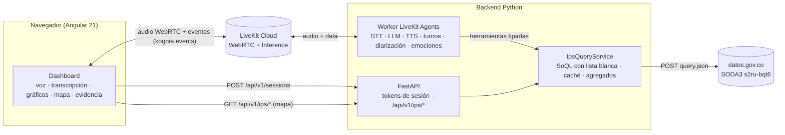

# Kognia Voice

Asistente conversacional por voz que responde preguntas sobre las **IPS (instituciones prestadoras de
servicios de salud) de Colombia** usando exclusivamente la API oficial de datos abiertos
[datos.gov.co · `s2ru-bqt6`](https://www.datos.gov.co/d/s2ru-bqt6). Funciona con **varias personas
compartiendo un mismo micrófono**: transcribe en vivo, distingue voces (diarización), estima emociones
a partir del texto, responde hablando y muestra cada respuesta como gráficos, mapa de Colombia y
evidencia verificable.

> El usuario habla → Kognia comprende → consulta datos oficiales → responde por voz → visualiza → permite explorar.

---

## Contenido

1. [Qué hace](#qué-hace)
2. [Arquitectura](#arquitectura)
3. [Stack](#stack)
4. [Estructura del repositorio](#estructura-del-repositorio)
5. [Puesta en marcha local](#puesta-en-marcha-local)
6. [Configuración](#configuración)
7. [Fuente de datos](#fuente-de-datos)
8. [Conversación con micrófono compartido](#conversación-con-micrófono-compartido)
9. [Dashboard](#dashboard)
10. [API HTTP y eventos en tiempo real](#api-http-y-eventos-en-tiempo-real)
11. [Calidad y pruebas](#calidad-y-pruebas)
12. [Despliegue](#despliegue)
13. [Seguridad y privacidad](#seguridad-y-privacidad)
14. [Limitaciones conocidas](#limitaciones-conocidas)
15. [Uso de inteligencia artificial](#uso-de-inteligencia-artificial)
16. [Créditos y licencias de datos](#créditos-y-licencias-de-datos)

Documentos complementarios:

| Documento | Contenido |
|---|---|
| [docs/DECISIONES_Y_METRICAS.md](docs/DECISIONES_Y_METRICAS.md) | Decisiones técnicas con la evidencia medida que las respalda |
| [docs/DESPLIEGUE.md](docs/DESPLIEGUE.md) | Guía paso a paso de despliegue |
| [docs/PRUEBAS_MULTIHABLANTE.md](docs/PRUEBAS_MULTIHABLANTE.md) | Protocolo de pruebas manuales con varias personas |
| [backend/README.md](backend/README.md) | Detalle del backend (agente de voz + API) |
| [frontend/README.md](frontend/README.md) | Detalle del frontend Angular |

---

## Qué hace

- **Conversación natural por voz en tiempo real** (WebRTC vía LiveKit): se habla sin palabra de
  activación y se interrumpe a Kognia hablando. Ignora muletillas sueltas (“sí”, “ok”) y une preguntas
  que llegaron partidas (“necesito que me…” + “…digas cuántas IPS hay en Caldas”).
- **Modo de activación opcional** (`TURN_MODE=wake_word`): para salas con mucha conversación ajena,
  solo responde a “Kognia, …”, a preguntas claras sobre IPS y a seguimientos breves.
- **Respuestas fundamentadas**: el modelo de lenguaje solo elige herramientas con parámetros tipados;
  el backend construye las consultas SoQL desde listas blancas y consulta la API oficial. Ninguna cifra
  sale del conocimiento propio del modelo.
- **Diarización real** por palabra (Deepgram): “Hablante 1”, “Hablante 2”…; los fragmentos no
  atribuibles se marcan como hablante desconocido y las voces superpuestas se señalan.
- **Análisis de sentimiento y emoción** por intervención, estimado a partir del texto (modelos
  RoBERTuito en español).
- **Dashboard generativo**: cada resultado se convierte en métricas, barras, dona o tabla; los
  rankings por departamento actualizan un **mapa coroplético de Colombia**.
- **Panel de evidencia**: fuente, dataset, herramienta, filtros, fecha, unidad de análisis y
  limitaciones de cada respuesta.
- **Trazabilidad de latencia** por turno, correlacionada entre backend y navegador.

## Arquitectura



**Flujo de un turno de voz**

1. El navegador pide una sesión a la API; recibe un token LiveKit de 30 minutos, limitado a una sala,
   que además despacha al agente `kognia-voice`.
2. El audio del micrófono llega al worker por WebRTC. ai-coustics `QUAIL_L` reduce ruido sin aislar a
   un solo hablante; Deepgram nova-3 transcribe en español con diarización por palabra.
3. Un detector de fin de turno decide cuándo terminó la intervención. El `ConversationController`
   alinea las transcripciones con el turno confirmado y el `TurnManagementService` decide: responder,
   ignorar una muletilla, esperar el resto de la frase o pedir que repitan si hablaron varias personas.
4. Gemini 2.5 Flash elige una herramienta (`count_ips`, `group_ips`, `search_ips`, `get_ips_details`,
   `get_dataset_overview`); el `IpsQueryService` consulta la API oficial (o sus agregados precargados).
5. Cartesia Sonic-3 sintetiza la respuesta en streaming. En paralelo, el dashboard recibe eventos con
   el resultado verificado, la transcripción, los hablantes, la emoción y la traza de latencia.

## Stack

| Capa | Tecnología |
|---|---|
| Frontend | Angular 21 (standalone, signals, zoneless), TypeScript estricto, Tailwind CSS 4, Lucide, `livekit-client` 2.22, `d3-geo` 3.1 |
| Tiempo real | LiveKit Cloud (WebRTC, text streams, LiveKit Inference) |
| Agente | Python 3.12, LiveKit Agents 1.8.5 |
| Voz | STT `deepgram/nova-3` (es, diarización) · LLM `google/gemini-2.5-flash` · TTS `cartesia/sonic-3` (voz “Daniela”, es-MX) · detector de fin de turno de LiveKit · ai-coustics `QUAIL_L` |
| Emociones | `pysentimiento` (RoBERTuito sentimiento + emoción, español), en un hilo aparte |
| API | FastAPI, Pydantic v2, pydantic-settings, HTTPX asíncrono |
| Calidad | Pytest, respx, Ruff, Vitest (vía `ng test`), Playwright con Chrome para e2e |
| Gestión | `uv` (Python), npm (frontend) |

## Estructura del repositorio

```
kognia-hackathon/
├── backend/
│   ├── app/
│   │   ├── api/                 # FastAPI: rutas, esquemas, errores, rate limit
│   │   ├── application/services # IpsQueryService, catálogo de valores, agregados, tokens de sesión
│   │   ├── config/              # Settings (variables de entorno) y composición
│   │   ├── domain/models         # Contratos Pydantic (resultados, eventos, transcripción, emoción)
│   │   ├── emotions/            # Clasificador de sentimiento/emoción y worker asíncrono
│   │   ├── infrastructure/socrata # Cliente SODA3, constructor SoQL, caché de consultas
│   │   ├── voice/               # Worker LiveKit: agente, herramientas, turnos, diarización, latencia
│   │   └── main.py              # App FastAPI
│   ├── bench/                   # Benchmarks y harness e2e (latencia, audio, LLM, TTS, reportes)
│   ├── tests/unit/              # 139 pruebas
│   ├── Dockerfile               # Imagen del worker de voz
│   ├── Dockerfile.api           # Imagen de la API
│   └── pyproject.toml
├── frontend/
│   ├── src/app/core/            # Modelos, servicios (LiveKit, store, dashboard, API), config
│   ├── src/app/features/        # conversation, transcription, viz, map, evidence, emotions, metrics, dashboard
│   ├── public/geo/              # GeoJSON de departamentos (geoBoundaries / OSM)
│   └── e2e/                     # Scripts Playwright (voz e2e, verificación visual)
└── docs/                        # Decisiones, métricas, despliegue, protocolo de pruebas
```

## Puesta en marcha local

**Requisitos**: Python 3.12 con [`uv`](https://docs.astral.sh/uv/), Node.js 20+ y un proyecto de
[LiveKit Cloud](https://cloud.livekit.io) (incluye LiveKit Inference para STT/LLM/TTS).

```bash
# 1. Backend
cd backend
cp .env.example .env.local          # completa LIVEKIT_URL, LIVEKIT_API_KEY, LIVEKIT_API_SECRET
uv sync --extra agent               # dependencias de API + agente (incluye torch CPU)

# Terminal A: API HTTP
uv run uvicorn app.main:app --port 8000

# Terminal B: worker de voz (espera "registered worker"; la primera vez descarga modelos)
uv run python app/voice/worker.py dev

# 2. Frontend
cd ../frontend
npm install
npx ng serve                        # http://localhost:4200
```

Abre `http://localhost:4200`, pulsa **Iniciar conversación**, autoriza el micrófono y di
*“Kognia, ¿cuántas IPS hay en el Quindío?”*. La pestaña **Mapa** funciona sin voz.

> El backend lee `backend/.env.local` (y `backend/.env`). Un `.env` en la raíz del repositorio **no**
> se carga automáticamente.

## Configuración

Variables en `backend/.env.local` (plantilla: [`backend/.env.example`](backend/.env.example)).

| Variable | Obligatoria | Defecto | Uso |
|---|---|---|---|
| `LIVEKIT_URL` | sí | — | URL `wss://…livekit.cloud` del proyecto |
| `LIVEKIT_API_KEY` / `LIVEKIT_API_SECRET` | sí | — | Credenciales del proyecto (solo backend) |
| `LIVEKIT_AGENT_NAME` | no | `kognia-voice` | Nombre con el que se registra y despacha el agente |
| `SOCRATA_APP_TOKEN` | recomendada | vacío | Token de datos.gov.co; sin él la API aplica límites más bajos |
| `CORS_ORIGINS` | en producción | `http://localhost:4200` | Orígenes permitidos (coma o lista JSON) |
| `RATE_LIMIT_PER_MINUTE` | no | `60` | Límite por cliente en `/api/*` |
| `SESSION_TOKEN_TTL_MINUTES` | no | `30` | Vigencia del token de sala |
| `NOISE_MODEL` | no | `quail_l` | `none`, `quail_l`, `quail_vf_s`, `quail_vf_l` |
| `TURN_MODE` | no | `open` | `open` (conversación natural) o `wake_word` (exige “Kognia”); el dashboard se adapta al modo del agente |
| `FOLLOW_UP_WINDOW_S` | no | `8` | En modo `wake_word`: segundos para un seguimiento sin decir “Kognia” |
| `TOOL_FILLER_DELAY_S` | no | `0.7` | Espera antes de una frase neutra si la consulta tarda; negativo la desactiva |
| `ENDPOINTING_MIN_DELAY_S` / `_MAX_DELAY_S` | no | `0.5` / `3.0` | Fin de turno |
| `SOCRATA_TIMEOUT_S` | no | `8` | Timeout por consulta (sin reintento ante timeout) |
| `SOCRATA_CACHE_TTL_S` / `AGGREGATE_TTL_S` | no | `600` / `1800` | Caché de consultas y de agregados precargados |

El frontend toma la URL de la API de `frontend/src/environments/environment*.ts`.

## Fuente de datos

Dataset **“Relación de IPS públicas y privadas según el nivel de atención y capacidad instalada”**
(Ministerio de Salud y Protección Social, REPS), consultado con SODA3
(`POST https://www.datos.gov.co/api/v3/views/s2ru-bqt6/query.json`). Es la **única** fuente de
afirmaciones sobre IPS: no hay RAG, documentos ni bases vectoriales.

Hechos verificados contra la API (octubre de 2026):

| Dato | Valor |
|---|---|
| Filas | 41.427 — cada fila es **una línea de capacidad instalada de una sede**, no una IPS |
| Prestadores únicos (`c_digo_prestador`) | 9.320 |
| Sedes únicas (`c_digo_sede`) | 10.921 |
| Nivel de atención vacío | 61 % de los registros |
| Corte de los datos | REPS 5 nov 2022 (actualización del dataset: 21 nov 2022) |
| Columna `departamento` | Incluye distritos reportados por separado: Barranquilla, Cartagena, Santa Marta, Cali, Buenaventura |

Por eso Kognia distingue **registros, sedes y prestadores únicos** en cada respuesta y advierte las
limitaciones cuando cambian la interpretación. La fuente no contiene servicios habilitados,
especialidades, horarios, tarifas, calidad ni EPS; el agente lo dice en lugar de inventarlo.

**Cómo se consulta de forma segura**

- El LLM nunca escribe SoQL: elige herramientas con parámetros tipados.
- `SoqlQuery` acepta solo columnas de una lista blanca, escapa literales y valida identificadores numéricos.
- Departamentos, municipios, naturaleza, nivel y grupo de capacidad se resuelven contra un **catálogo
  descargado de la propia API** (tolerante a tildes; “Armenia” existe en Antioquia y Quindío y se avisa).
- Un **guardián de filtros** descarta filtros que el usuario no mencionó (se observó al modelo
  inventar `nivel_atencion="sin dato"`).
- Caché TTL con deduplicación de consultas en vuelo y **agregados precargados** (conteos por
  departamento y naturaleza) para las preguntas más frecuentes; las respuestas lo indican.

## Conversación con micrófono compartido

**Modo natural (`open`, por defecto)**

| Situación | Comportamiento |
|---|---|
| “Hola, ¿cómo estás?”, “¿Cuántas IPS hay en Caldas?” | Responde (con consulta a la fuente cuando hay datos de por medio) |
| “Sí”, “ok”, “gracias” sueltos | No responde (muletilla) |
| Pregunta partida por una pausa | Retiene el fragmento y lo une con la continuación del mismo hablante |
| Alguien habla mientras Kognia responde | Kognia se interrumpe (interrupción adaptativa: ignora “ajá” y ruidos) |
| Varias voces a la vez | “Escuché varias personas al mismo tiempo… ¿podrías repetirla?” |

En este modo Kognia también responde a conversaciones que no van dirigidas a ella; con mucha gente
hablando en la sala conviene el modo de activación.

**Modo de activación (`TURN_MODE=wake_word`)**

| Situación | Comportamiento |
|---|---|
| “Kognia, ¿cuántas IPS hay en Caldas?” | Responde (activación confirmada) |
| “Cognia / Cocnea / Konia …” al inicio | Responde (variante fonética probable) |
| “la compañía tiene sedes” | Ignora (mención ambigua) |
| Charla entre personas | Se transcribe, no se responde |
| “Kognia.” solo | Dice “Te escucho” sin usar el LLM y espera la pregunta |
| Pregunta clara sobre IPS mientras Kognia habla | Se responde al terminar la respuesta en curso |
| “Kognia” mientras Kognia habla | Interrumpe y atiende la nueva pregunta |
| Seguimiento en 8 s del mismo hablante | Responde sin repetir “Kognia” |

La diarización proviene de los identificadores de hablante por palabra de Deepgram. Los fragmentos de
una palabra entre dos tramos del mismo hablante se marcan como no atribuibles en lugar de reasignarse.
La detección de solapamiento combina alternancia rápida de hablantes y grupos de palabras de baja
confianza con al menos dos hablantes (ver métricas y límites en
[docs/DECISIONES_Y_METRICAS.md](docs/DECISIONES_Y_METRICAS.md)).

## Dashboard

- **Voz**: orbe que reacciona al audio real (micrófono en cian, voz de Kognia en violeta), estados
  desconectado/conectando/escuchando/te escucho/procesando/consultando/respondiendo/error, subtítulos,
  entrada por texto (topic `lk.chat`) y selector de micrófono.
- **Visualización**: especificaciones tipadas (`metric`, `table`, `bar_chart`, `horizontal_bar`,
  `donut_chart`, `line_chart`, `colombia_map`) derivadas **solo** de resultados de herramientas. No se
  usan gráficos de línea porque el dataset no tiene dimensión temporal.
- **Mapa**: coroplético de 33 departamentos (sedes o registros, filtro por naturaleza), selección por
  clic o teclado con zoom, estadísticas del departamento desde la API, distritos sumados a su
  departamento solo en métricas aditivas, “sin datos” diferenciado de cero. Los prestadores únicos no
  se mapean porque no son sumables entre territorios. Se carga de forma diferida (chunk de 13 kB).
- **Evidencia**: datos verificados vs. resumen generado vs. limitaciones vs. falta de información, con
  insignia de caché y filtros descartados.
- **Transcripción**: línea temporal por hablante, parciales y finales, voces superpuestas, hablante
  incierto, interrupciones, emociones por segmento y **corrección manual** que conserva el original.
- **Análisis**: distribución de sentimiento, evolución emocional y latencia por turno (p50/p95 del
  agente y del navegador).
- **Accesibilidad**: navegación por teclado, foco visible, tamaño de letra, subtítulos,
  `prefers-reduced-motion`, estados con texto e icono; diseño adaptable (barra de pestañas en móvil).
- **Exportar**: descarga la sesión (transcripción, correcciones, decisiones, emociones, latencias) en JSON.

## API HTTP y eventos en tiempo real

| Método | Ruta | Descripción |
|---|---|---|
| `GET` | `/health` | Estado y si la voz está configurada |
| `POST` | `/api/v1/sessions` | Crea sesión: sala, identidad y token LiveKit con despacho del agente |
| `POST` | `/api/v1/sessions/{id}/token` | Renueva el token de una sala existente (reconexión) |
| `GET` | `/api/v1/ips/overview` | Descripción, totales, campos y limitaciones del dataset |
| `GET` | `/api/v1/ips/count` | Registros, sedes y prestadores con filtros |
| `GET` | `/api/v1/ips/group` | Ranking por dimensión permitida (`dimension`, `metric`, `top_n`) |
| `GET` | `/api/v1/ips/search` | Búsqueda de sedes por nombre/ubicación, paginada |
| `GET` | `/api/v1/ips/sites/{codigo_sede}` | Detalle de una sede y su capacidad instalada |

Documentación interactiva en `http://localhost:8000/docs`.

El agente publica eventos JSON en el text stream `kognia.events` con sobre
`{type, session_id, seq, turn_id, emitted_at, payload}`: `session.*`, `agent.listening|thinking|speaking`,
`agent.interrupted`, `transcript.partial|final`, `speaker.identified`, `emotion.analyzed`,
`ips.query.started|completed|failed`, `turn.decision`, `turn.mode`, `metrics.turn`, `metrics.client`,
`error.occurred`. El navegador devuelve sus mediciones de reproducción por el topic
`kognia.client_metrics`. Los contratos están en `backend/app/domain/models/` y
`frontend/src/app/core/models/`.

## Calidad y pruebas

```bash
cd backend && uv run pytest -q && uv run ruff check app tests bench   # 139 pruebas
cd frontend && npx ng test --watch=false && npx ng build              # 23 pruebas
```

- **Backend**: SoQL y escapado, cliente SODA3 (reintentos, 401/403/429/5xx, timeout, tamaño),
  servicio de consultas, agregados, catálogo, API (CORS, rate limit, tokens), diarización,
  solapamiento, palabra de activación, consolidación, alineación de turnos, controlador, latencia,
  emociones, configuración.
- **Frontend**: store de conversación (sesiones, orden, parciales→finales, mediciones), constructor
  de visualizaciones, catálogo geográfico, escala del mapa y renderizado con respuestas reales
  grabadas de la API.
- **End-to-end** (`frontend/e2e/voice-e2e.mjs`): Chrome real usa un WAV como micrófono, conversa con
  el agente vía LiveKit y exporta la sesión; `backend/bench/e2e_report.py` compara cada decisión con
  la esperada. `frontend/e2e/ui-check.mjs` verifica el dashboard en 1920/1440/390 px.

Resultados y metodología: [docs/DECISIONES_Y_METRICAS.md](docs/DECISIONES_Y_METRICAS.md).

## Despliegue

| Componente | Dónde | Cómo |
|---|---|---|
| Worker de voz | LiveKit Cloud Agents (o cualquier host de contenedores) | `backend/Dockerfile`, `lk agent deploy` |
| API | Azure Container Apps / App Service (contenedor) | `backend/Dockerfile.api` |
| Frontend | Azure Static Web Apps / cualquier hosting estático | `npx ng build` → `dist/frontend/browser` |

Pasos, variables y verificación: [docs/DESPLIEGUE.md](docs/DESPLIEGUE.md).

## Seguridad y privacidad

- Credenciales de LiveKit y Socrata **solo** en el backend; el navegador recibe un token de sala con
  permisos mínimos (micrófono, datos) y vencimiento.
- CORS restringido, límite de solicitudes por cliente, validación de entradas con Pydantic, tamaños y
  paginación acotados, SoQL generado desde listas blancas.
- No se graba audio ni se guardan conversaciones en el servidor; la exportación ocurre en el navegador.
- Los registros de herramientas omiten datos personales de los prestadores (gerente, correo).
- Los logs del agente pueden incluir tokens de sesión: están excluidos del repositorio.

## Limitaciones conocidas

- **Diarización**: con voces sintéticas, 2 hablantes se distinguen bien, 3 suelen fundirse en 2 y
  con 4 se detectan 3 (~82 % de atribución). Los identificadores pueden cambiar en fragmentos muy
  cortos. Faltan pruebas con personas reales (protocolo listo en `docs/PRUEBAS_MULTIHABLANTE.md`).
- **Solapamiento**: se detecta cerca de la mitad de los casos sintéticos; cuando Deepgram transcribe
  limpiamente una sola de las voces, no hay señal textual que lo revele.
- **Modo natural**: responde también a conversación no dirigida a Kognia. En modo de activación, la
  palabra “Kognia” se reconoce sobre texto transcrito (no es detección acústica); si el STT la omite,
  solo una pregunta clara sobre IPS o un seguimiento activan la respuesta.
- **Emociones**: se estiman a partir del texto, no del tono de voz; no son evaluaciones psicológicas.
- **Latencia**: dominada por dos llamadas al LLM en turnos con consulta y por la variabilidad de
  Socrata (se observaron consultas de 84 s sin app token).
- **Cuota**: STT, LLM y TTS consumen la cuota de LiveKit Inference del proyecto; al agotarse, el
  agente deja de hablar (`inference_quota_exceeded`).
- La selección de un departamento en el mapa no se transmite como contexto a la siguiente pregunta por voz.

## Uso de inteligencia artificial

**En el producto**: Deepgram nova-3 (transcripción y diarización), Gemini 2.5 Flash (comprensión y
redacción de respuestas; solo elige herramientas, no aporta datos), Cartesia Sonic-3 (voz), el
detector de fin de turno y la interrupción adaptativa de LiveKit, ai-coustics (supresión de ruido) y
pysentimiento (sentimiento y emoción). Ningún gráfico ni cifra proviene de texto generado por el LLM.

**En el desarrollo**: el proyecto se construyó durante el hackatón con Claude Code (modelo Claude
Opus) como asistente de programación: implementación, pruebas, benchmarks y documentación, con
decisiones y validación del equipo. Las métricas citadas provienen de ejecuciones reales registradas
en `backend/bench/results/`.

## Créditos y licencias de datos

- Datos de IPS: Ministerio de Salud y Protección Social, [datos.gov.co](https://www.datos.gov.co/d/s2ru-bqt6).
- Límites departamentales: [geoBoundaries](https://www.geoboundaries.org) gbOpen COL ADM1, a partir de
  OpenStreetMap © contribuyentes, licencia [ODbL 1.0](https://www.openstreetmap.org/copyright).
  Simplificado por redondeo de coordenadas y reorientación de anillos.
- Modelos de emoción: [pysentimiento](https://github.com/pysentimiento/pysentimiento) (RoBERTuito).
- Base del agente: [LiveKit agent-starter-python](https://github.com/livekit-examples/agent-starter-python) (MIT).
